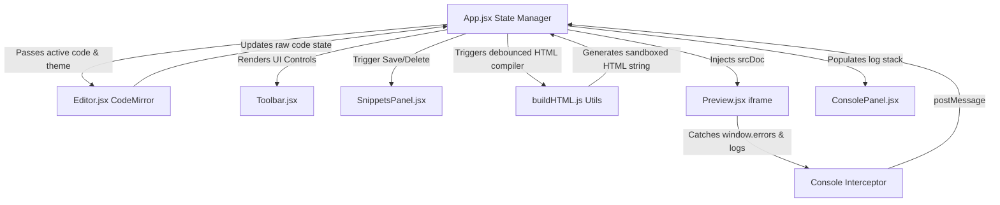

# 🛠️ CodeForge

CodeForge is a modern, lightweight, and blazing-fast web-based code playground designed for front-end developers, educators, and creators. Write HTML, CSS, and JavaScript, and watch your changes render instantly in a real-time, sandboxed browser preview.

With native CodeMirror integration, local storage backups, responsive side-by-side editing, preloaded starter templates, and an integrated console panel, CodeForge delivers a fully featured IDE experience right inside your web browser.

---

## ✨ Key Features

- **⚡ Real-time Live Preview**: Zero-latency updates. Your code compiles and runs instantly in a sandboxed `iframe` with debounced execution to keep the browser responsive.
- **📝 High-performance Code Editor**: Powered by **CodeMirror 6** with language-specific syntax highlighting, tab-to-indent support, line numbers, and character indicators.
- **📟 Integrated Console Panel**: A custom virtual console captures and formats `console.log`, `console.warn`, and `console.error` messages straight from your sandbox in real-time.
- **🎨 Starter Templates**: Start coding immediately with pre-built boilerplate configurations, including Counter apps, Todo applications, and specialized CSS animations.
- **💾 Local Storage Persistence**: Never lose your work. Your code and layout preferences are automatically saved locally.
- **📂 Personal Snippet Library**: Save, load, edit, and delete custom snippets to speed up your prototyping flow.
- **↕️ Fully Adjustable Pane Layout**: Click and drag the vertical divider to change the editor/preview size ratio (clamped from 25% to 75%).
- **📦 Single-file Export**: Download your bundled project as a single, ready-to-run HTML file with embedded styles and logic.

---

## 🛠️ Tech Stack

CodeForge is built using a modern, reactive stack optimized for web environments:

- **Library**: [React 18](https://react.dev/) (Functional components, hooks, custom state hooks)
- **Editor Core**: [CodeMirror 6](https://codemirror.net/) (Modular code editor framework)
- **Bundler**: [Vite](https://vitejs.dev/) (Supercharged dev server and bundling tool)
- **Styling**: Vanilla CSS (Tailored variables, dark/light themes, smooth transitions)
- **Deployment**: [Vercel](https://vercel.com/) (Optimized deployment support via `vercel.json`)

---

## 🏗️ Architecture

CodeForge utilizes a unidirectional state flow, communication between the iframe sandbox, and debounced render cycles.



### Key Architectural Concepts:
1. **Debounced Compilation**: The application uses React `useEffect` coupled with a debounced timeout of 500ms to rebuild the target preview HTML. This prevents unnecessary reflows and browser lag during active typing.
2. **Iframe Message Passing**: Console logs are intercepted inside the sandboxed frame by overwriting `window.console` and posting structured events up to the parent window via `window.parent.postMessage()`.
3. **Responsive Resize System**: An event-driven listener handles pointer coordinates during divider dragging, updating percentage-based flex layouts dynamically.

---

## 📁 Repository Structure

```text
CodeForge/
├── .gitignore            # Git exclusion patterns
├── index.html            # Main SPA entry point
├── package.json          # Dependency definition & scripts
├── vercel.json           # Vercel deployment configuration
├── vite.config.js        # Vite bundler configurations
└── src/
    ├── App.jsx           # Root layout, drag-resizer, & core state
    ├── index.css         # Styling system, tokens, and dark/light themes
    ├── main.jsx          # React app mounting point
    ├── components/
    │   ├── ConsolePanel.jsx  # Formats and renders intercepted logs
    │   ├── Editor.jsx        # Wraps CodeMirror 6 with theme & language modules
    │   ├── Preview.jsx       # Custom sandboxed iframe container
    │   ├── SnippetsPanel.jsx # Interface for saved local snippets
    │   ├── Toast.jsx         # Custom notifications/alerts
    │   └── Toolbar.jsx       # Action buttons, theme toggle, and loaders
    ├── hooks/
    │   └── useLocalStorage.js # Custom React state hooks synced with LocalStorage
    └── utils/
        ├── buildHTML.js      # Utility compiling HTML/CSS/JS into a sandboxed document
        └── templates.js      # Ready-made starter templates
```

---

## 🚀 Getting Started

Follow these steps to run CodeForge on your local machine:

### Prerequisites
Make sure you have [Node.js](https://nodejs.org/) installed (v18 or higher recommended).

### Installation
1. Clone the repository:
   ```bash
   git clone https://github.com/your-username/codeforge.git
   cd codeforge
   ```

2. Install dependencies:
   ```bash
   npm install
   ```

3. Start the local development server:
   ```bash
   npm run dev
   ```

4. Open your browser and navigate to `http://localhost:5173` (or the port specified in your terminal).

---

## 💻 Building for Production

To compile a highly optimized production bundle:

```bash
npm run build
```

The output will be generated in the `dist/` directory, ready to be hosted on Netlify, Vercel, or GitHub Pages.

---

## 🤝 Contributing

Contributions make the open-source community an amazing place to learn, inspire, and create. Any contributions you make are **greatly appreciated**.

1. Fork the Project
2. Create your Feature Branch (`git checkout -b feature/AmazingFeature`)
3. Commit your Changes (`git commit -m 'Add some AmazingFeature'`)
4. Push to the Branch (`git push origin feature/AmazingFeature`)
5. Open a Pull Request

---

## 📄 License

Distributed under the MIT License. See `LICENSE` for more information.

---

<div align="center">
  <p><b>Created & Developed with ❤️ by <a href="https://github.com/your-username">Krishna</a></b></p>
</div>
